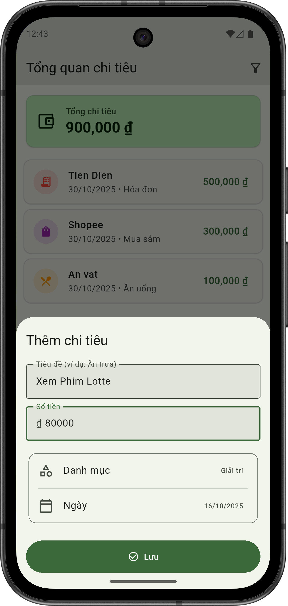

## Thông tin sinh viên
- Lê Cẩm Bình
- MSSV: 22IT.EB007
- Lớp HP: HK1_2526_Phát triển ứng dụng di động đa nền tảng (2)

# 🚀 Flutter Intermediate Project Set (2 Weeks – 10 Projects)
---

## Project 1

  
  

---

## Project 2

  
  
  
  

---

## Project 3

  
  
  

---

## Project 4

  
  

---

## Project 5

  
  
  
  

---

## Project 6

  

---

## Project 7

  
  
  
  
  

---

## Project 8

  
  
  

---

## Project 9

  
  

---

## Project 10

  
  
  
  

